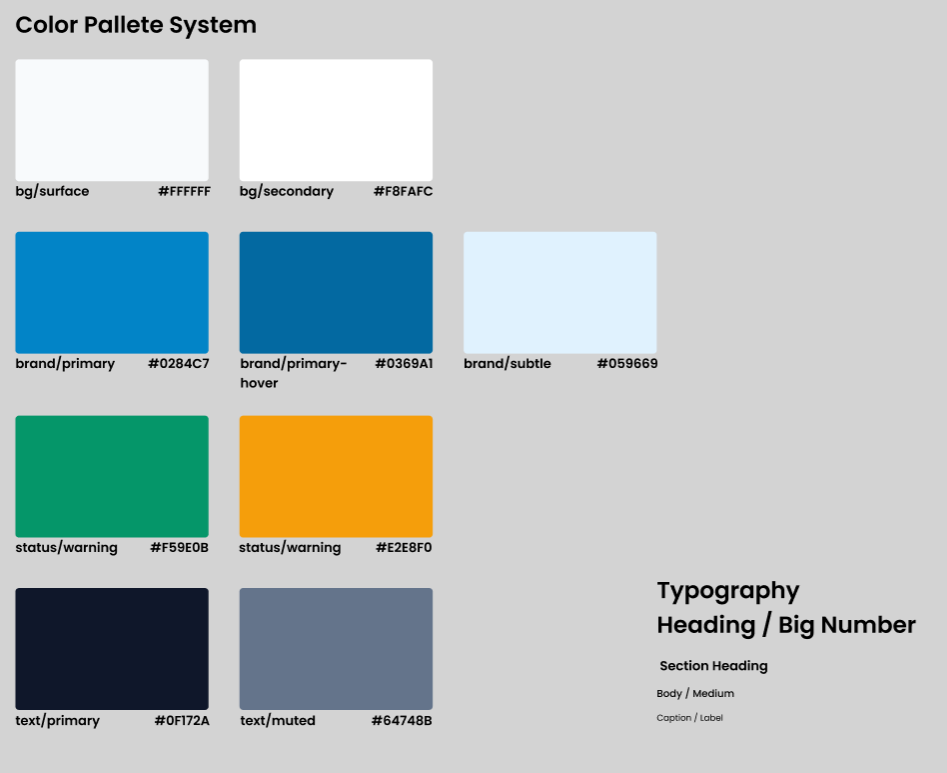

# Color Palette & Typography System

## Color Palette

### Background Colors
- bg/surface: #FFFFFF (Background Card, Modal, Dropdown, Table)
- bg/secondary: #F8FAFC (Background halaman utama)

### Brand Colors
- brand/primary: #0284C7 (Button utama, Active State)
- brand/primary-hover: #0369A1 (State hover)
- brand/subtle: #059669 (Highlight lembut, Badge)

### Status Colors
- status/success: #F59E0B (Status/Badge)
- status/warning: #E2E8F0 (Warning/Alert)

### Text Colors
- text/primary: #0F172A (Heading, Title, Teks Utama)
- text/muted: #64748B (Subtitle, Label, Placeholder)

## Typography
- Heading / Big Number
- Section Heading
- Body / Medium
- Caption / Label

 